# voting_list
## Authors
21.06.2019,
authors:
* Michał Szkarłat
* Mateusz Wieczorek


## Elections to the European Parliament 2019
Its a simple application that generate votes from packed data and plot various graphs. 
Raw data source is here:
```
https://wybory.gov.pl/pe2019/pl/dane_w_arkuszach
```

## Table of contents
* [Authors](#authors)
* [Extracting data](#extracting-data)
* [Joining data](#joining-data)
* [Graphs](#graphs)
* [Help](#help)


## Extracting data
After dowloading raw packages we need to procces them in order to get valid data that represent approximately 14 milions Polish voters from election to the European Parliament. To achive that we need to use <b> split_votes.py </b> file. Result data looks like this and represent each signle voter:


<i>Splited_parties.csv</i>

We are storing informations about:
* ID - represents signle voter
* TERYT
* JEDNOSTKA TERYTORIALNA
* GŁOSOWANIE PRZEZ POMOCNIKA
* GŁOSOWANIE NA PODSTAWIE ZAŚWIADCZENIA
* GŁOS NIEWAŻNY (oraz jego rodzaje)
* PARTIA

We do not store information about candidates and parties in same file. <b> Split_votes.py </b> generates also addictiona data file for candidates only, whitch looks like this:


<i>Splited_candidates.csv</i>
  
 We store informations about:
 * ID - represents signle voter
 * NUMER OKRĘGU
 * NUMER LISTY
 * NAZWA PARTII
 * NUMER NA LIŚCIE
 * NAZWISKO
 * IMIĘ
 * PŁĘĆ
 * ZAWÓD
 * ODDANY GŁOS
 
 Extracted data contains over 2 GB of data. To compress it without loosing information we need to use <b> split_votes.py </b>
 
 ## Joining data
Using <b> split_votes.py </b> script we can group some information from extracted data and get much smaller files.
Ressult looks like this.

### Joined parties:

<i>Joined_parties.csv</i>

### Joined candidates:

<i>Joined_candidates.csv</i>

## Graphs
### Zdobyte poparcie dla partii
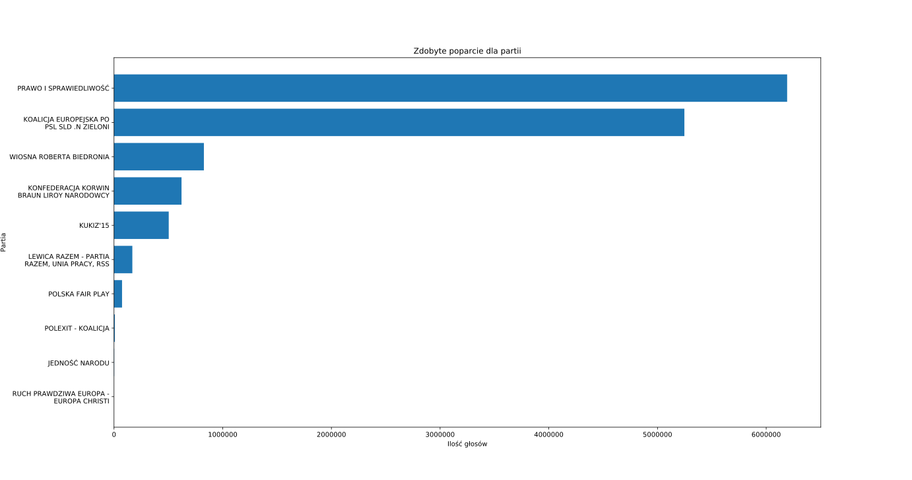
Na powyższym wykresie przedstawione są liczby głosów oddanych na poszczególne partie. Nie ma tu żadnych nowości, wyniki ukazane na tym wykresie pokrywają się z wynikami przedstawianymi w polskich mediach. Znaczną przewagę nad resztą partii posiadają Prawo i Sprawiedliwość oraz Koalicja Europejska.

### Zdobyte poparcie dla partii - probka 100000
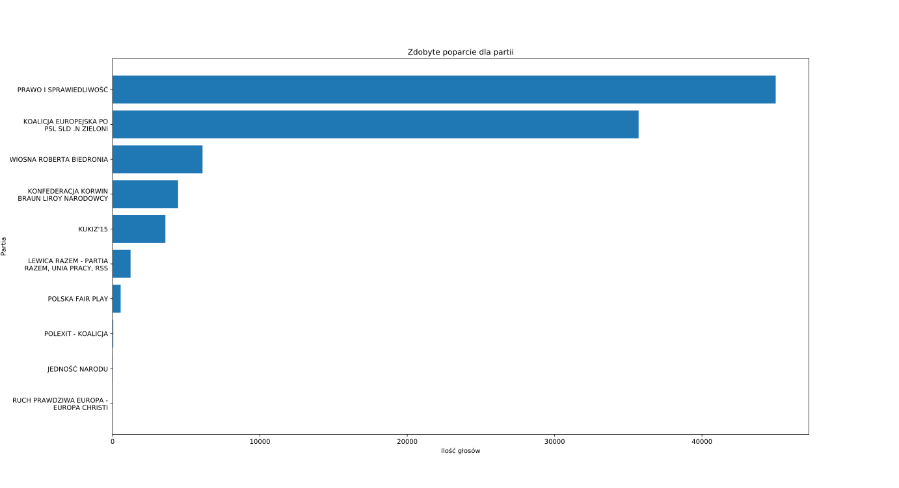
Z kolei na powyższym wykresie zostały przedstawione informacje na temat rozkładu tej samej cechy (ilości ważnych głosów oddanych na poszczególną partię), jednak zostały one przygotowane na podstawie próbki liczącej 100000 wpisów z całej populacji (~14 mln wpisów). Pomimo użycia wybierania próbki na podstawie zwykłego, komputerowego pseudolosowania, uzyskany wykres mocno przypomina wykres przedstawiony powyżej (słupki dla poszczególnych partii są proporcjonalnie długie). Oczywiście z powodu wybrania tylko 100000 wpisów, zmniejszyła się również ogólna liczba głosów.

### Liczba głosów nieważnych na terytorium
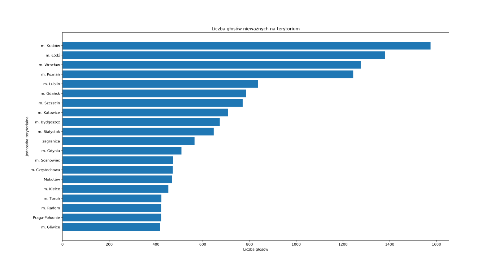
Na powyższym wykresie zostały przedstawione 20 takich jednostek terytorialnych, gdzie ilość nieważnych głosów była największa. Nie powinno być większego zaskoczenia, że w czołówce znajdują się największe miasta Polski. Jest to oczywiście spowodowane tym, że w tych miastach mieszka bardzo dużo ludzi, stąd też liczba pomyłkowo uzupełnionych kart głosowania jest większa. Jednak są również mniejsze miasta, np. jak Gliwice czy Radom, gdzie ilość nieważnych głosów jest duża.

### Poparcie dla kandydatów (top 10)
.svg)

### Poparcie dla kandydatów (top 30)
.svg)

### Liczba kandydatów na partię
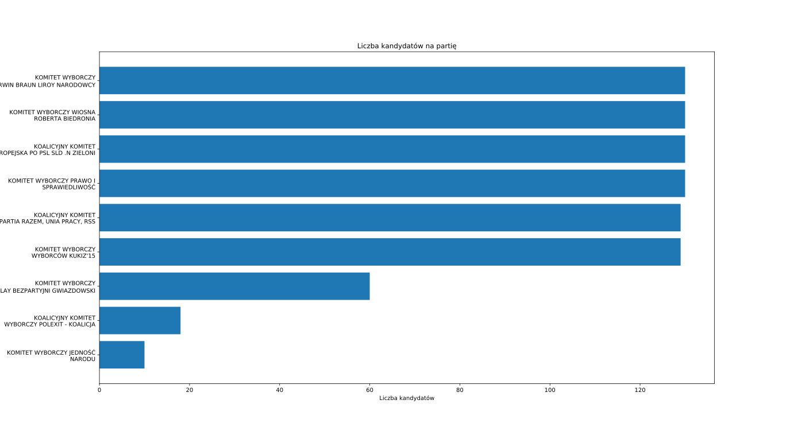

### Średnia liczba głosów na kandydatów partii
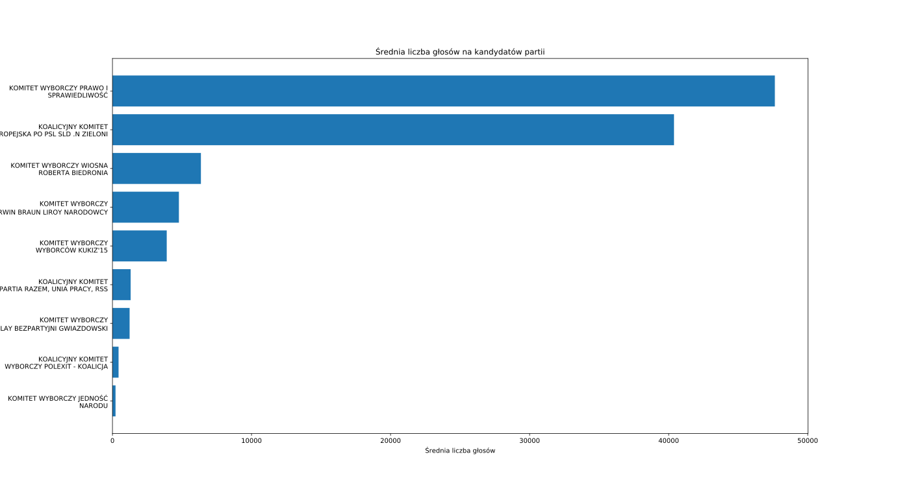

### Płeć kandydatów
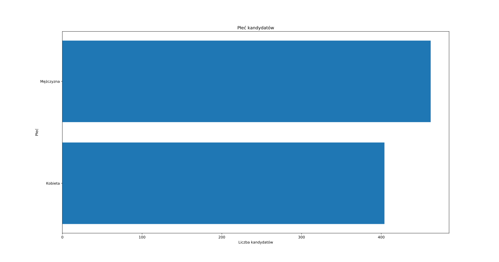

### Średnia liczba głosów na płeć
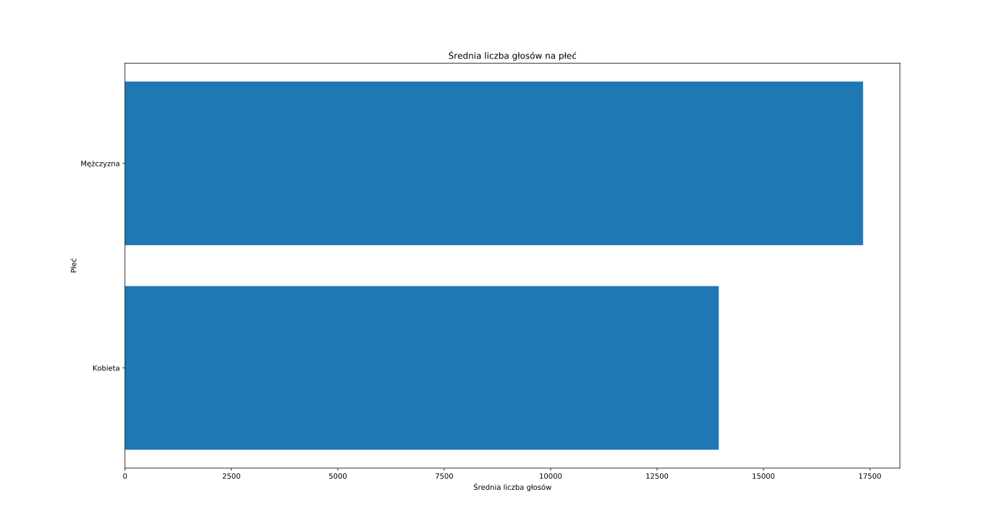

### Średnia liczba głosów na zawód
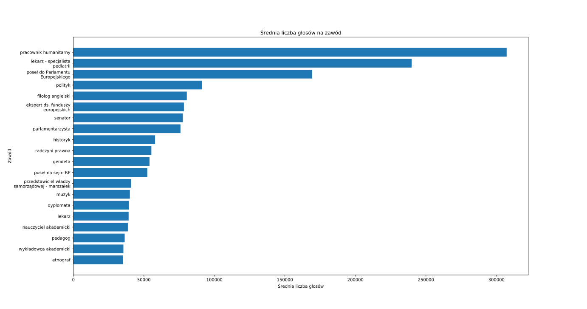

### Liczba kandydatów danego zawodu
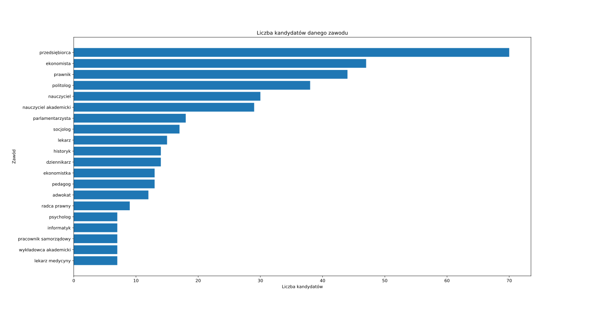

### Box plot dla zawodu ekonomista
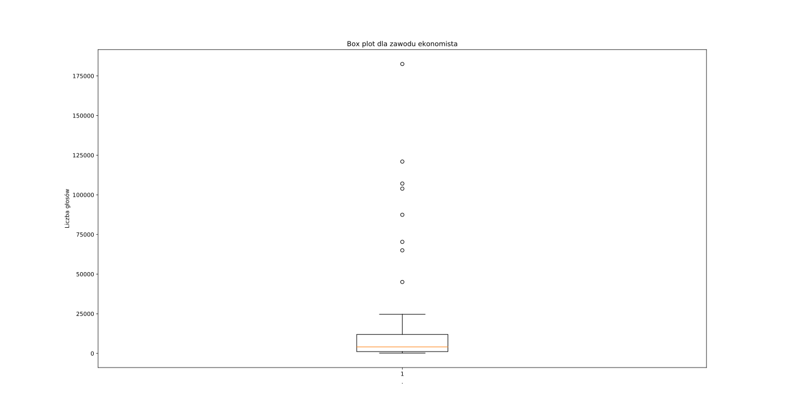

### Box plot dla zawodu nauczyciel akademicki
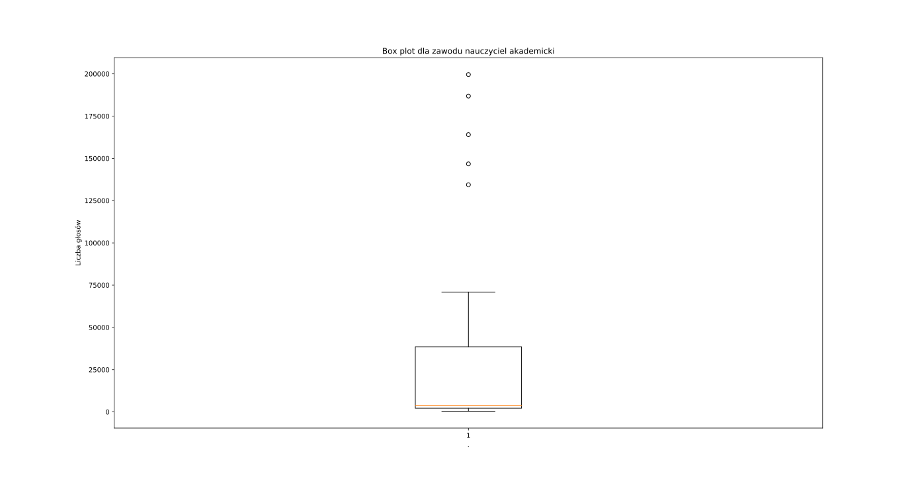

### Box plot dla zawodu polityk
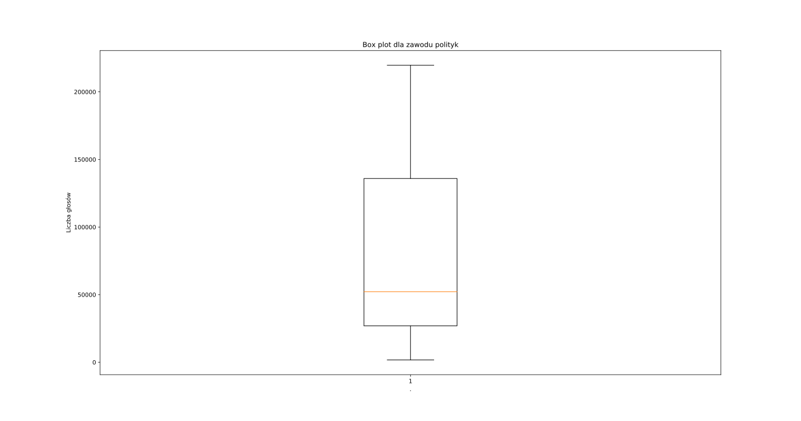

### Box plot dla zawodu przedsiębiorca
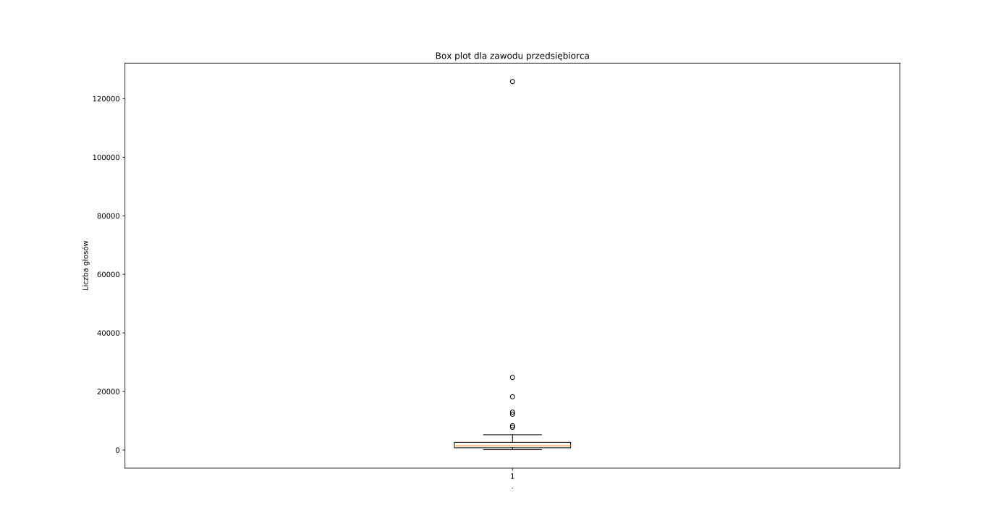

## Help
To start plotting graphs use:
```
$> python3 main.py
$> plot [tab]
```
